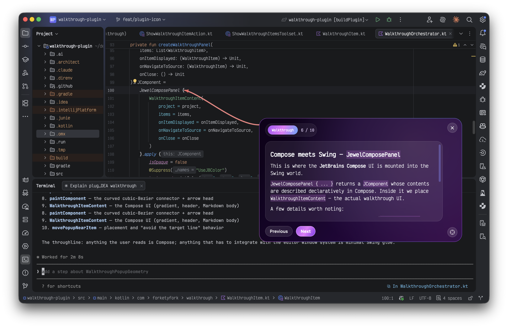

# Walkthrough Plugin

## About

Walkthrough Plugin is a prototype IntelliJ IDEA plugin for presenting inline walkthrough guidance
inside the editor. It shows a styled popup near a target line, keeps a connector anchored to that
line, and lets the user step through a sequence of walkthrough items.

## Features

- An MCP tool, `show_walkthrough_items`, that accepts JSON input and displays one or more
  walkthrough items with a description for history.
- Optional file and line navigation for each item, so a walkthrough can jump to the right place
  before rendering.
- Previous and Next navigation inside the popup for multi-step walkthroughs.
- Per-project walkthrough history stored under `.idea/walkthroughs/`, with a keymap-bindable
  action for replaying previous walkthroughs.
- A Compose-based popup UI rendered through Jewel on the IntelliJ Platform.

## Prerequisites

**Recommended:** Install [Nix](https://nixos.org/download) and [direnv](https://direnv.net), then
run `direnv allow` in the project directory. This provides JDK 21, pre-commit hooks, and all
development tooling automatically.

**Manual:** Install JDK 21. The Gradle wrapper is included in the repository.

## Development

| Command | Description |
| --- | --- |
| `just build` | Build the plugin |
| `just run` | Run in a sandboxed IDE instance |
| `just verify` | Verify plugin compatibility |
| `just lint` | Run Detekt static analysis |
| `just clean` | Clean build artifacts |
| `just hooks` | Install pre-commit hooks (Nix dev shell) |

Without `just`, use `./gradlew buildPlugin`, `./gradlew runIde`, etc. directly.

## Architecture

The plugin targets IntelliJ IDEA 261+ and uses JetBrains Compose (via the Jewel library) for all
UI. See [CLAUDE.md](CLAUDE.md) for detailed architecture documentation.
