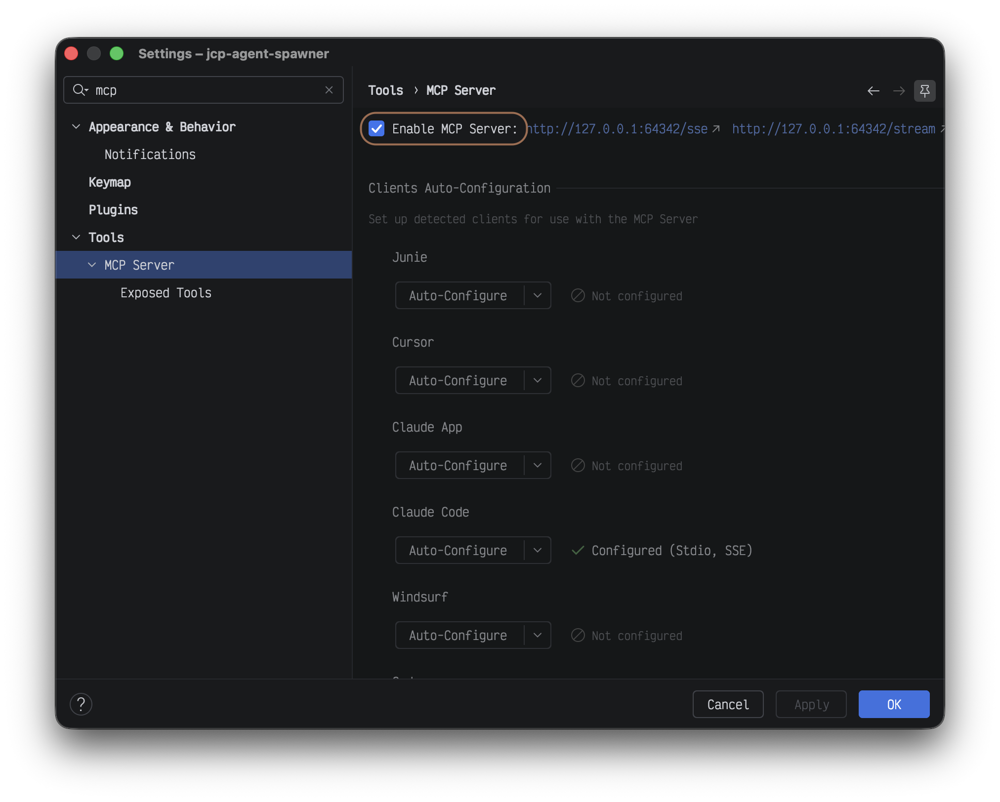

# Walkthrough Plugin

[](https://github.com/forketyfork/walkthrough-plugin/actions/workflows/build.yml)
[](https://kotlinlang.org/)

## About

Walkthrough Plugin is an IntelliJ IDEA plugin for presenting inline walkthrough guidance inside
the editor. It shows a styled popup near a target line, keeps a connector anchored to that line,
and lets the user step through a sequence of walkthrough items.

Available on the [JetBrains Marketplace](https://plugins.jetbrains.com/plugin/31637-walkthrough/).

<table>
  <tr>
    <td align="center">
      <a href="docs/popup.png">
        
      </a>
    </td>
    <td align="center">
      <a href="docs/history.png">
        
      </a>
    </td>
    <td align="center">
      <a href="docs/settings.png">
        
      </a>
    </td>
  </tr>
  <tr>
    <td align="center"><sub>Popup</sub></td>
    <td align="center"><sub>History</sub></td>
    <td align="center"><sub>Settings</sub></td>
  </tr>
</table>

## Getting started

Walkthroughs are driven by an MCP tool that the plugin exposes through the IDE. The setup is a
one-time wiring exercise between the IDE and your agent.

### 1. Install the plugin

Install **Walkthrough** from the
[JetBrains Marketplace](https://plugins.jetbrains.com/plugin/31637-walkthrough/), or from the IDE:
**Settings → Plugins → Marketplace**, search for *Walkthrough*, and click **Install**.

Requires IntelliJ IDEA 2026.1 or newer. The plugin depends on JetBrains' **MCP Server** plugin,
which the IDE installs alongside Walkthrough automatically.

### 2. Enable the MCP server

1. Open **Settings → Tools → MCP Server**.
2. Tick **Enable MCP Server** and apply.

This starts a local MCP server that exposes the walkthrough tools (and other built-in IDE tools)
to any MCP client you connect.

<a href="docs/mcp.png">
  
</a>

### 3. Connect your agent

On the same **MCP Server** settings page, use the **Clients Auto-Configuration** section to wire
up a supported client (Claude Code, Claude Desktop, Cursor, and others). The button writes the
correct configuration to that client's config file. Restart the client afterward so it picks up
the new server.

If your client is not in the list, configure it manually using the server URL shown on the same
settings page.

### 4. Run your first walkthrough

1. Open a project in IntelliJ IDEA.
2. In your agent, ask for a tour, for example:
   > *Use the IDEA walkthrough to explain how authentication works in this codebase.*
3. The agent calls the `show_walkthrough_items` MCP tool and the IDE renders the explanation as
   popups anchored to the relevant lines. Use **Previous** / **Next** in the popup to step
   through.
4. Ask follow-up questions directly in the popup. The agent's answer is inserted as a child step
   in the same walkthrough.

Walkthroughs are saved per project under `.idea/walkthroughs/` and can be replayed via
**Tools → Walkthrough → Show Walkthrough History** (bindable to a keymap shortcut).

### 5. Optional: companion walkthrough skill

A companion [walkthrough skill](https://github.com/forketyfork/agentic-skills) teaches the agent
how to structure good walkthroughs and when to reach for them. It is published in the
`agentic-skills` marketplace as a plain markdown skill and can be loaded by any agent that
supports markdown skills or custom instructions. If your client does not have a skills mechanism,
paste the skill contents into your agent's instructions file (`CLAUDE.md`, `AGENTS.md`,
`.cursor/rules`, or equivalent).

For Claude Code, install it directly from the marketplace:

```bash
/plugin marketplace add forketyfork/agentic-skills
/plugin install walkthrough@agentic-skills
```

Once loaded, the skill activates whenever you ask for a guided tour or step-by-step code
walkthrough.

## Features

- Three MCP tools: `show_walkthrough_items`, `await_walkthrough_question`, and
  `insert_walkthrough_tangents` display a walkthrough, wait for popup questions, and insert
  answer steps into the active walkthrough.
- Optional file and line navigation for each item, so a walkthrough can jump to the right place
  before rendering.
- Previous and Next navigation inside the popup for multi-step walkthroughs.
- Users can ask follow-up questions in the popup; answers are inserted as labeled child steps.
- Per-project walkthrough history stored under `.idea/walkthroughs/`, with a keymap-bindable
  action for replaying previous walkthroughs.
- User-selectable popup color palettes under the IDE settings.
- A Compose-based popup UI rendered through Jewel on the IntelliJ Platform.

## Development

### Prerequisites

**Recommended:** Install [Nix](https://nixos.org/download) and [direnv](https://direnv.net), then
run `direnv allow` in the project directory. This provides JDK 21, pre-commit hooks, and all
development tooling automatically.

**Manual:** Install JDK 21. The Gradle wrapper is included in the repository.

### Commands

| Command | Description |
| --- | --- |
| `just build` | Build the plugin |
| `just run` | Run in a sandboxed IDE instance |
| `just verify` | Verify plugin compatibility |
| `just lint` | Run Detekt static analysis |
| `just test` | Run unit tests |
| `just clean` | Clean build artifacts |
| `just publish` | Publish the plugin to JetBrains Marketplace |
| `just hooks` | Install pre-commit hooks (Nix dev shell) |

Without `just`, use `./gradlew buildPlugin`, `./gradlew runIde`, etc. directly.

## Architecture

The plugin targets IntelliJ IDEA 261+ and uses JetBrains Compose (via the Jewel library) for the
walkthrough popup UI. See [CLAUDE.md](CLAUDE.md) for detailed architecture documentation.
