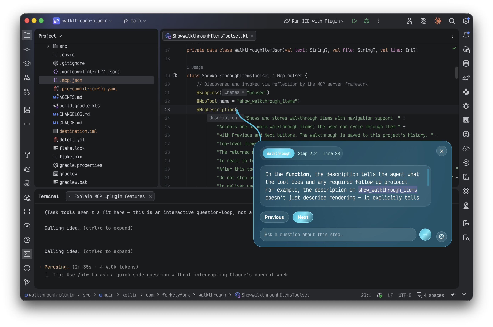
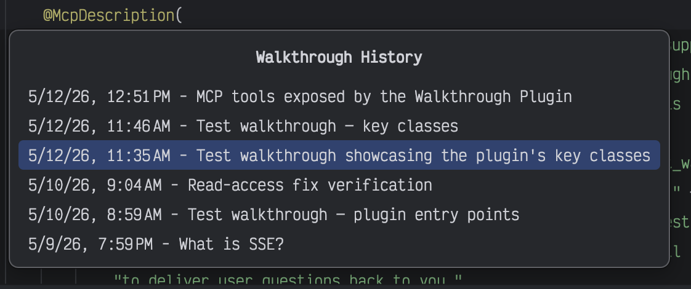
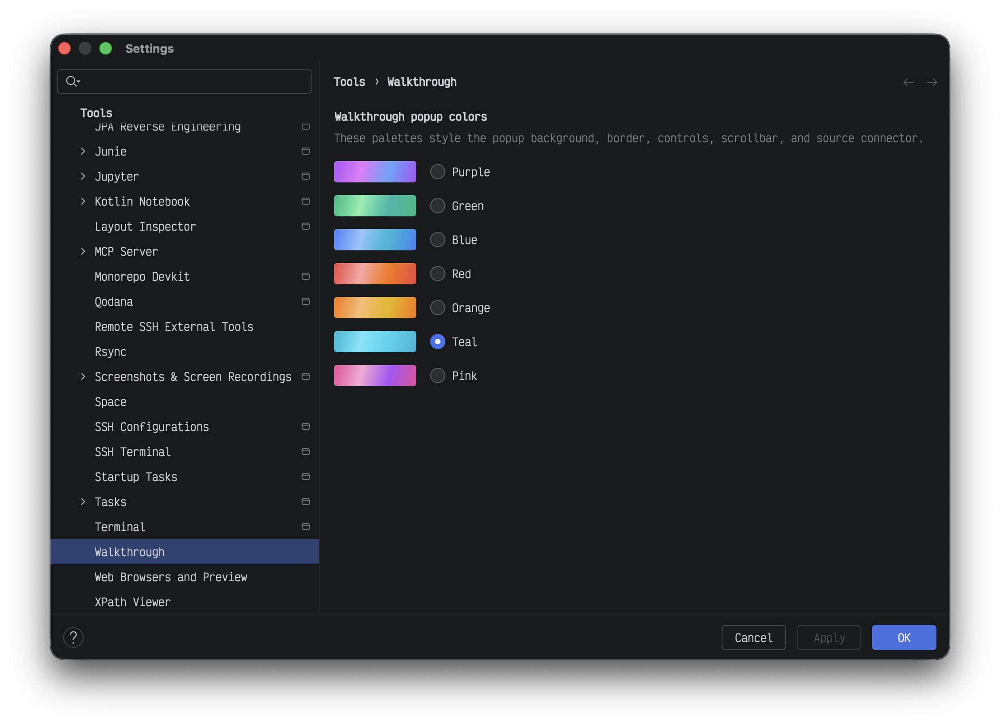

# Walkthrough Plugin

[](https://github.com/forketyfork/walkthrough-plugin/actions/workflows/build.yml)
[](https://kotlinlang.org/)

## About

Walkthrough Plugin is an IntelliJ IDEA plugin for presenting inline walkthrough guidance inside
the editor. It shows a styled popup near a target line, keeps a connector anchored to that line,
and lets the user step through a sequence of walkthrough items.

Available on the [JetBrains Marketplace](https://plugins.jetbrains.com/plugin/31637-walkthrough/).

<table>
  <tr>
    <td align="center">
      <a href="docs/popup.png">
        
      </a>
    </td>
    <td align="center">
      <a href="docs/history.png">
        
      </a>
    </td>
    <td align="center">
      <a href="docs/settings.png">
        
      </a>
    </td>
  </tr>
  <tr>
    <td align="center"><sub>Popup</sub></td>
    <td align="center"><sub>History</sub></td>
    <td align="center"><sub>Settings</sub></td>
  </tr>
</table>

## Features

- Three MCP tools: `show_walkthrough_items`, `await_walkthrough_question`, and
  `insert_walkthrough_tangents` display a walkthrough, wait for popup questions, and insert
  answer steps into the active walkthrough.
- Optional file and line navigation for each item, so a walkthrough can jump to the right place
  before rendering.
- Previous and Next navigation inside the popup for multi-step walkthroughs.
- Users can ask follow-up questions in the popup; answers are inserted as labeled child steps.
- Per-project walkthrough history stored under `.idea/walkthroughs/`, with a keymap-bindable
  action for replaying previous walkthroughs.
- User-selectable popup color palettes under the IDE settings.
- A Compose-based popup UI rendered through Jewel on the IntelliJ Platform.

## Claude Code skill

A companion skill that teaches agents how to author walkthroughs is published in the
[agentic-skills](https://github.com/forketyfork/agentic-skills) marketplace. Install it in
Claude Code with:

```bash
/plugin marketplace add forketyfork/agentic-skills
/plugin install walkthrough@agentic-skills
```

Once installed, the skill activates whenever you ask for a guided tour or step-by-step code
walkthrough, and can be invoked explicitly as `/walkthrough`.

## Prerequisites

**Recommended:** Install [Nix](https://nixos.org/download) and [direnv](https://direnv.net), then
run `direnv allow` in the project directory. This provides JDK 21, pre-commit hooks, and all
development tooling automatically.

**Manual:** Install JDK 21. The Gradle wrapper is included in the repository.

## Development

| Command | Description |
| --- | --- |
| `just build` | Build the plugin |
| `just run` | Run in a sandboxed IDE instance |
| `just verify` | Verify plugin compatibility |
| `just lint` | Run Detekt static analysis |
| `just test` | Run unit tests |
| `just clean` | Clean build artifacts |
| `just publish` | Publish the plugin to JetBrains Marketplace |
| `just hooks` | Install pre-commit hooks (Nix dev shell) |

Without `just`, use `./gradlew buildPlugin`, `./gradlew runIde`, etc. directly.

## Architecture

The plugin targets IntelliJ IDEA 261+ and uses JetBrains Compose (via the Jewel library) for the
walkthrough popup UI. See [CLAUDE.md](CLAUDE.md) for detailed architecture documentation.
